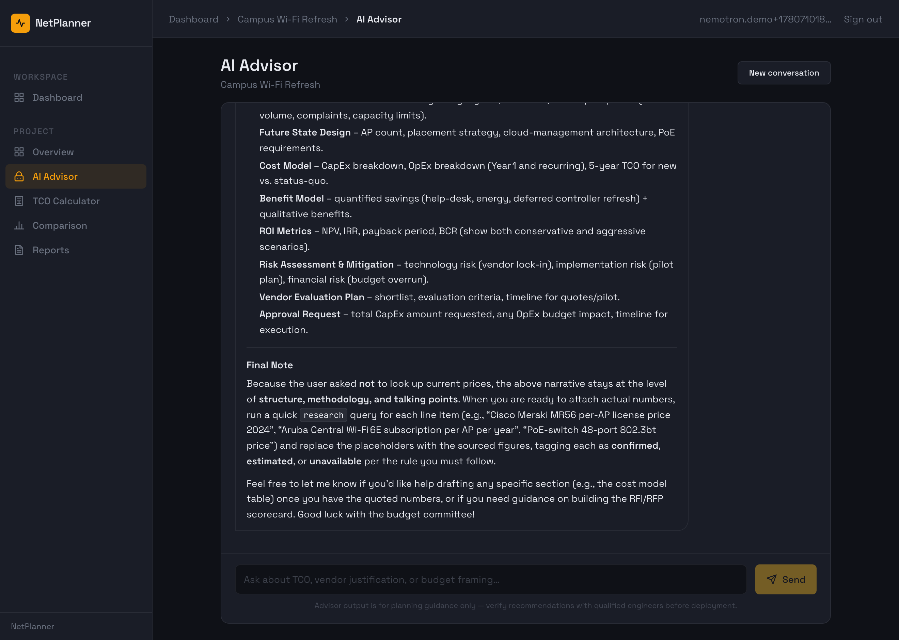

# Eval Results

Outputs from `backend/scripts/eval_compare.py`, one JSON per (fixture, provider).
Research data is supplied from `../fixtures/`, so each matrix reflects the
**model's reasoning alone** (no live web search) — making Claude vs Nemotron an
apples-to-apples comparison.

Reproduce (from `backend/`):

```bash
uv run python scripts/eval_compare.py                 # both providers
uv run python scripts/eval_compare.py --fixture campus-wifi
```

## Phase 2a — `campus-wifi` (2026-06-05)

First **live** run of the Comparison agent on NVIDIA Nemotron through the
provider layer (not a mock).

| | `claude-sonnet-4-6` (baseline) | `nvidia/nemotron-3-super-120b-a12b` |
|---|---|---|
| Matrix completeness | 3×4, full | 3×4, full |
| Confidence tagging | all `estimated` (honest) | all `estimated` (honest) |
| Style | verbose, adds domain knowledge, heavily hedged | concise, grounded in supplied research, propagates source URLs |
| Failure modes seen | none | none |

Qualitatively, Nemotron held up well on this structured-synthesis task. The
numeric LLM-as-judge scoring (NeMo Evaluator) is Phase 2b — see
[`../runbooks/02-nemo-evaluator.md`](../runbooks/02-nemo-evaluator.md).

Raw outputs: `campus-wifi__anthropic.json`, `campus-wifi__nvidia_nim.json`.

## Phase 2a — the live app on Nemotron (screenshots)

The full NetPlanner app run with `provider=nvidia_nim` — the **Advisor streaming a
real business-decision answer from Nemotron**, captured via Playwright
(`../scripts/capture_screenshots.py`).



Images in `../images/`:
- `nemotron-advisor.png` — full Advisor answer (the hero shot; crop as needed)
- `nemotron-advisor-hero.png` — viewport crop
- `nemotron-advisor-empty.png` — Advisor empty state
- `nemotron-dashboard.png` — project view

**Finding #6 (the standout):** the first live Advisor run on Nemotron returned
*no answer* — Nemotron chose to call the `research` tool four rounds straight
(hitting the tool-loop cap) on a framing/ROI question that Claude answers
directly. Same question + "do not look anything up" → a clean, single-round
10k-char advisory answer. **Tool-use propensity is model-dependent** — an agent's
tool-loop budget and guardrails tuned for one model can loop forever on another.
The demo question is phrased to stay single-round; see [`../ISSUES-LOG.md`](../ISSUES-LOG.md).
